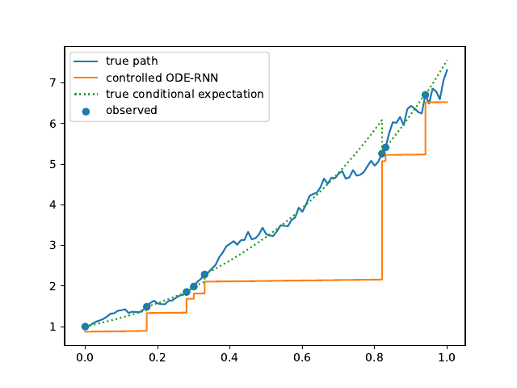
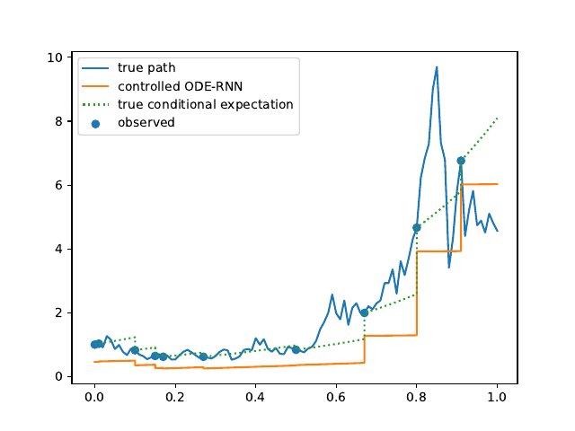

# Theoretical Guarantees for Learning Conditional Expectation using Controlled ODE-RNN

This repository is the official implementation of 
[Theoretical Guarantees for Learning Conditional Expectation using Controlled ODE-RNN](todo). 


## Requirements

This code was executed using Python 3.7.

To install requirements, download this Repo and cd into it. Then:

```setup
pip install -r requirements.txt
```


## Training & Testing

To train and test the model(s) of the paper, run these commands (other 
hyperparameters can be changed in the main section of demo.py):

go to the source directory:
```train
cd controlled_ODE_RNN
```

for Black-Scholes model:
```train
python demo.py --dataset='BlackScholes'
```

for Heston model:
```train
python demo.py --dataset='Heston'
```

for Ornstein-Uhlenbeck model:
```train
python demo.py --dataset='OrnsteinUhlenbeck'
```

If no dataset for the model was generated yet, it will be generated 
automatically before the training starts.
ATTENTION: if you run the demo for a pretrained model first, a dataset with 
only 100 samples (instead of 20'000) will be generated for plotting. This should
be deleted before training a new model, such that a bigger dataset is generated
and used.

The model is trained and concurrently saved and tested after every <save_every>
epoch.
The plots that are generated are saved in "../data/saved_models/id-<model_id>/plots/"
and the training progress is printed.


## Pre-trained Models

Pre-trained models for each of the 3 stochastic models are distributed with the
code and saved in "../data/saved_models/id-x" for x=1,2,3.
These pre-trained models can be loaded and used to generate sample paths with 
the following commands:

go to the source directory:
```train
cd controlled_ODE_RNN
```

- for Black-Scholes model:
```train
python demo.py --model_id=1
```

- for Heston model:
```train
python demo.py --model_id=2
```

- for Ornstein-Uhlenbeck model:
```train
python demo.py --model_id=3
```

If no dataset for the model was generated yet, a small version of the dataset 
with 100 samples will be generated automatically, such that plots can be 
produced.
ATTENTION: this dataset should be replaced with a bigger one for training (the 
datasets are saved in "../data/training_data/" and can be deleted there).

The pretrained models are loaded and used for plotting. No training. The plots
are saved in "../data/saved_models/id-x/plots/" for x=1,2,3.


## Results

Black-Scholes:



Heston:



Ornstein-Uhlenbeck:


## Usage, License & Citation

This code can be used in accordance with the LICENSE.txt.

If you find this code useful, please cite our paper: [Theoretical Guarantees for Learning Conditional Expectation using Controlled ODE-RNN](todo).

```citation

```


## Acknowledgements and References
Parts of this code are base on the code of: https://github.com/edebrouwer/gru_ode_bayes, of the paper [GRU-ODE-Bayes](https://arxiv.org/abs/1905.12374).

The GIFs of the training progress were generated with imageio:
[](https://doi.org/10.5281/zenodo.3674137)


