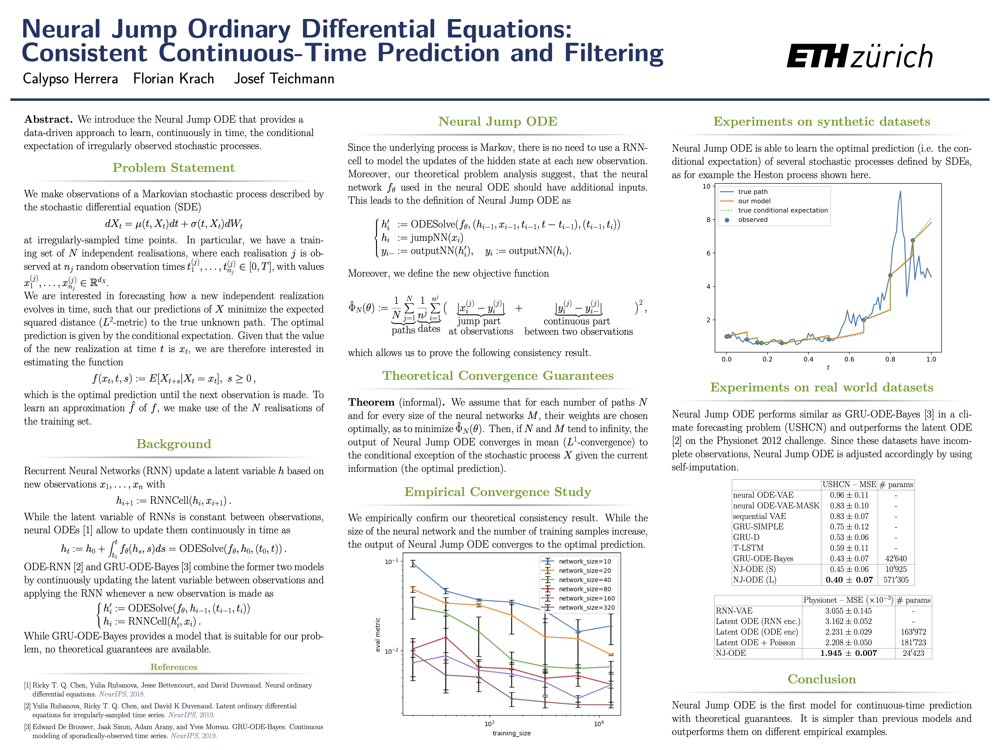
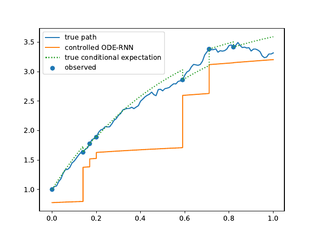

# Neural Jump Ordinary Differential Equations

[](https://zenodo.org/badge/latestdoi/269355048)

This repository is the official implementation of 
[Neural Jump Ordinary Differential Equations: Consistent Continuous-Time Prediction and Filtering](https://openreview.net/forum?id=JFKR3WqwyXR). 

For a short summary of the paper see our video-presentation at the 
[ICLR conference](https://iclr.cc/virtual/2021/poster/3339).
Below we also provide the poster summarizing our work that we presented there.




## Requirements

This code was executed using Python 3.7.

To install requirements, download this Repo and cd into it. Then:

```setup
pip install -r requirements.txt
```


## Training & Testing

To train and test the model(s) of the paper, run these commands (other 
hyperparameters can be changed in the main section of demo.py):

go to the source directory:
```train
cd NJODE
```

for Black-Scholes model:
```train
python demo.py --dataset='BlackScholes'
```

for Heston model:
```train
python demo.py --dataset='Heston'
```

for Ornstein-Uhlenbeck model:
```train
python demo.py --dataset='OrnsteinUhlenbeck'
```

If no dataset for the model was generated yet, it will be generated 
automatically before the training starts.
ATTENTION: if you run the demo for a pretrained model first, a dataset with 
only 100 samples (instead of 20'000) will be generated for plotting. This should
be deleted before training a new model, such that a bigger dataset is generated
and used.

The model is trained and concurrently saved and tested after every <save_every>
epoch.
The plots that are generated are saved in "../data/saved_models/id-<model_id>/plots/"
and the training progress is printed.


## Pre-trained Models

Pre-trained models for each of the 3 stochastic models are distributed with the
code and saved in "../data/saved_models/id-x" for x=1,2,3.
These pre-trained models can be loaded and used to generate sample paths with 
the following commands:

go to the source directory:
```demo
cd controlled_ODE_RNN
```

- for Black-Scholes model:
```demo
python demo.py --model_id=1
```

- for Heston model:
```demo
python demo.py --model_id=2
```

- for Ornstein-Uhlenbeck model:
```demo
python demo.py --model_id=3
```

If no dataset for the model was generated yet, a small version of the dataset 
with 100 samples will be generated automatically, such that plots can be 
produced.
ATTENTION: this dataset should be replaced with a bigger one for training (the 
datasets are saved in "../data/training_data/" and can be deleted there).

The pretrained models are loaded and used for plotting. No training. The plots
are saved in "../data/saved_models/id-x/plots/" for x=1,2,3.


## Empirical convergence study
Models for the empirical convergence study were trained using parallel_train.py
with the model parameters specified below
```
# ==========================================================================
# parallel training for convergence analysis
# ==========================================================================
```
in the main part of the file parallel_train.py.

For training: uncomment the code below the model params and run the file.


## Heston dataset without Feller condition
Models for the Heston dataset without Feller condition were trained using 
parallel_train.py with the model parameters specified below
```
# ==========================================================================
# parallel training for Heston without Feller
# ==========================================================================
```
in the main part of the file parallel_train.py.

For training: uncomment the code below the model params and run the file.


## Combined stock models (regime switch)
Models for the combined stock model dataset were trained using 
parallel_train.py with the model parameters specified below
```
# ==========================================================================
# parallel training for Combined stock models
# ==========================================================================
```
in the main part of the file parallel_train.py.

For training: uncomment the code below the model params and run the file.


## Sine stock models (explicit time dependence)
Models for the sine stock model dataset were trained using 
parallel_train.py with the model parameters specified below
```
# ==========================================================================
# parallel training for sine stock models
# ==========================================================================
```
in the main part of the file parallel_train.py.

For training: uncomment the code below the model params and run the file.

    
## Comparison to GRU-ODE-Bayes on synthetic dataset
Models for the comparison to GRU-ODE-Bayes were trained using parallel_train.py
with the model parameters specified below
```
# ==========================================================================
# parallel training for GRU-ODE-Bayes
# ==========================================================================
```
in the main part of the file parallel_train.py.

For training: uncomment the code below the model params and run the file.

For easier evaluation after training, use the function-call:
```
get_training_overview(
    params_extract_desc=('dataset', "other_model",
                         'network_size', 'training_size',
                         'hidden_size', "GRU_ODE_Bayes-mixing",
                         "GRU_ODE_Bayes-logvar", "GRU_ODE_Bayes-impute",
                         "GRU_ODE_Bayes-mixing"),
    val_test_params_extract=(("max", "epoch", "epoch", "epochs_trained"),
                             ("min", "evaluation_mean_diff",
                              "evaluation_mean_diff", "eval_metric_min"),
                             ("last", "evaluation_mean_diff",
                              "evaluation_mean_diff", "eval_metric_last"),
                             ("average", "evaluation_mean_diff",
                              "evaluation_mean_diff", "eval_metric_average")
                             )
)
``` 
in extras.py.


## Training on Climate Dataset
The preprocessed climate data that was provided by [GRU-ODE-Bayes](https://arxiv.org/abs/1905.12374)
together with the cross-validation indices generated with their provided 
code, is saved in data/training_data/climate/, s.t. models can be trained right 
away.

Models for cross-validation on the climate dataset were trained using 
parallel_train.py
with the model parameters specified below
```
# ==========================================================================
# parallel training on climate dataset
# ==========================================================================
```
in the main part of the file parallel_train.py.

For training: uncomment the code below the model params and run the file.

For performing/evaluating the cross-validation use the function-call:
```
get_training_overview(
    params_extract_desc=('dataset', 'network_size', 'dropout_rate',
                         'hidden_size', 'data_index'),
    val_test_params_extract=(("max", "epoch", "epoch", "epochs_trained"),
                             ("min", "eval_metric",
                              "eval_metric", "eval_metric_min"),
                             ("min", "test_metric",
                              "test_metric", "test_metric_min"),
                             ("min", "eval_metric",
                              "test_metric", "test_metric_evaluation_min"),
                             ("min", "eval_loss",
                              "test_metric", "test_metric_eval_loss_min"),
                             )
)

get_climate_cross_validation(early_stop_after_epoch=100)
``` 
in extras.py.


## Training on Physionet Dataset
The Physionet dataset that was used by 
[Latent ODEs for Irregularly-Sampled Time Series](https://arxiv.org/abs/1907.03907)
is downloaded and saved automatically when training for the first time. Moreover,
the preprocessing steps provided in this paper are applied automatically.

Models for validation on the Physionet dataset were trained using 
parallel_train.py
with the model parameters specified below
```
# ==========================================================================
# parallel training on physionet dataset
# ==========================================================================
```
in the main part of the file parallel_train.py.

For training: uncomment the code below the model params and run the file.

For performing/evaluating the validation (based on 5 runs) use the function-call:
```
# ------------ validation of physionet training -------------
get_training_overview(
    path='{}saved_models_physionet_comparison/'.format(train.data_path),
    params_extract_desc=('dataset', 'network_size', 'dropout_rate',
                         'hidden_size', 'data_index'),
    val_test_params_extract=(("max", "epoch", "epoch", "epochs_trained"),
                             ("min", "eval_metric",
                              "eval_metric", "eval_metric_min"),
                             ("min", "eval_metric_2",
                              "eval_metric_2", "eval_metric_2_min"),
                             )
)

get_cross_validation(
    path='{}saved_models_physionet_comparison/'.format(train.data_path),
    save_path='{}saved_models_physionet_comparison/'
              'cross_val.csv'.format(train.data_path),
    param_combinations=({'network_size': 50},
                        {'network_size': 200},
                        {'network_size': 400}),
    val_test_params_extract=(("max", "epoch", "epoch", "epochs_trained"),
                             ("min", "eval_metric",
                              "eval_metric", "eval_metric_min"),
                             ("min", "eval_metric_2",
                              "eval_metric_2", "eval_metric_2_min"),
                             ("last", "eval_metric_2",
                              "eval_metric_2", "eval_metric_2_last"),
                             ("min", "train_loss",
                              "eval_metric_2", "eval_metric_2_eval_min"),
                             ),
    target_col=('eval_metric_min', 'eval_metric_2_min',
                'eval_metric_2_last', 'eval_metric_2_eval_min')
)
``` 
in extras.py.
    

## Results

### Evolution of model predictions during training
Evolution of the model output (with old name "controlled ODE-RNN") on sample test paths 
during training (i.e. increasing umber of epochs) for the 3 synthetic datasets.


Black-Scholes:


Heston:


Ornstein-Uhlenbeck:




## Usage, License & Citation

This code can be used in accordance with the LICENSE.txt.

If you find this code useful, please cite our paper: [Neural Jump Ordinary Differential Equations: Consistent Continuous-Time Prediction and Filtering](https://openreview.net/forum?id=JFKR3WqwyXR).

```
@inproceedings{
herrera2021neural,
title={Neural Jump Ordinary Differential Equations: Consistent Continuous-Time Prediction and Filtering},
author={Calypso Herrera and Florian Krach and Josef Teichmann},
booktitle={International Conference on Learning Representations},
year={2021},
url={https://openreview.net/forum?id=JFKR3WqwyXR}
}
```


## Acknowledgements and References
Parts of this code are based on and/or copied from the code of: 
https://github.com/edebrouwer/gru_ode_bayes, of the paper 
[GRU-ODE-Bayes: Continuous modeling of sporadically-observed time series](https://arxiv.org/abs/1905.12374)
and the code of: https://github.com/YuliaRubanova/latent_ode, of the paper
[Latent ODEs for Irregularly-Sampled Time Series](https://arxiv.org/abs/1907.03907).

The GIFs of the training progress were generated with imageio:
[](https://doi.org/10.5281/zenodo.3674137)

